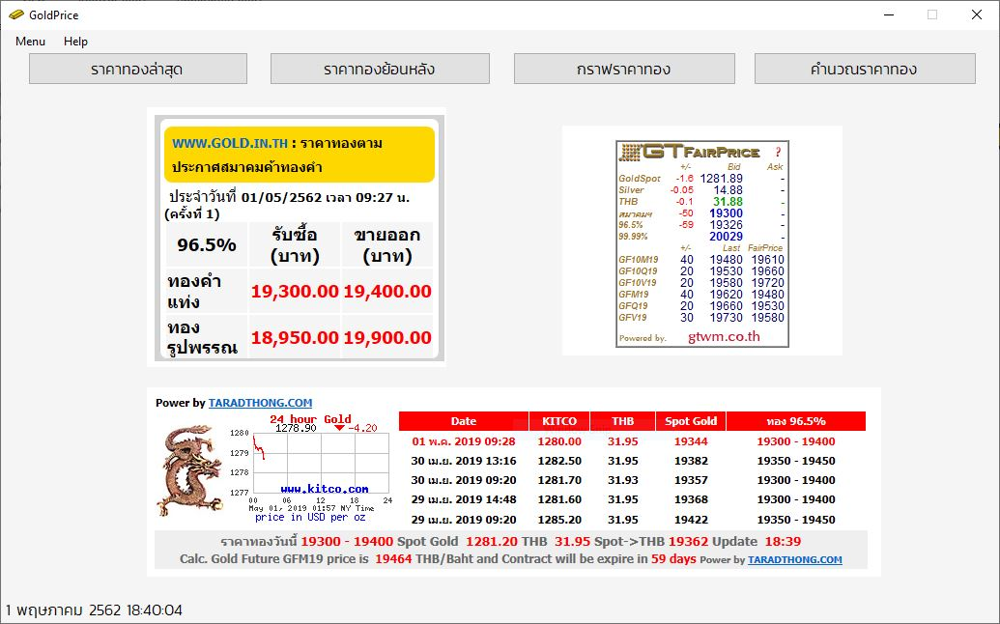

# โปรแกรมราคาทอง GoldPrice

  

โปรแกรมรายงานราคาทองในประเทศไทย ทั้งราคาทองคำแท่งและทองคำรูปพรรณประจำวัน
## บทคัดย่อ
  เนื่องจากในปัจจุบันราคาทองมีการเปลี่ยนแปลงอยู่ตลอดเวลาซึ่งสาเหตุก็มาจากหลายปัจจัยโดยสาเหตุแรกมาจากค่าเงินดอลลาร์ซึ่งราคาทองจะเคลื่อนไหวในทิศทางตรงข้ามกับค่าเงินดอลลาร์สหรัฐ เพราะทองคำซื้อขายเป็นเงินดอลลาร์สหรัฐ เมื่อค่าเงินดอลลาร์สหรัฐลดลง ราคาทองคำจะปรับตัวเพิ่มขึ้น เมื่อไรที่ค่าเงินดอลลาร์เพิ่มค่าขึ้นราคาทองจะปรับตัวลดลง สาเหตุที่สอง ดีมานด์ซัพพลาย (demand supply) และ เงินเฟ้อ (inflation) ในยามที่อัตราเงินเฟ้อสูง ราคาทองคำก็จะปรับตัวสูงขึ้น และในยามที่อัตราเงินเฟ้อต่ำ ราคาทองคำก็มีแนวโน้มที่จะอ่อนตัวลงสาเหตุเหล่านี้เป็นปัจจัยที่จะส่งผลกระทบต่อการเคลื่อนไหวของราคาทองคำทำให้ราคาทองเปลี่ยนแปลงอยู่เสมอ
  
## วัตถุประสงค์ของโปรแกรม
  สำหรับนักลงทุนหรือผู้ที่สนใจและติดตามราคาทองคำการติดตามความเคลื่อนไหวตลอดเวลามีความสำคัญค่อนข้างมาก ซึ่งสามารถช่วยให้ผู้ใช้ดูความเคลื่อนไหวของราคาทองคำได้ทุกวันหรือราคาทองคำย้อนหลัง พร้อมกับการคำนวณส่วนต่างของราคาทองก่อนการลงทุน เพื่อไม่ให้พลาดโอกาสและจังหวะสำคัญในการลงทุน

  

หน้าตาของโปรแกรม

  
## คุณสมบัติของโปรแกรม
  * แสดงราคาทองคำแท่ง
  * แสดงราคาทองคำรูปพรรณ
  * แสดงราคาทองคำย้อนหลัง
  * แสดงกราฟราคาทองคำแบบเรียลไทม์และย้อนหลังได้ถึง 1 ปี (USD:ดอลลาร์สหรัฐฯ)
  * คำนวณส่วนต่างราคาทอง
  * แสดงหรือซ่อนเวลาและวันที่
  * เปลี่ยนสีหน้าตาของโปรแกรม

## องค์ประกอบของโปรแกรม
  * C++ in Visual Studio Code 2017

## อ้างอิง
 * www.taladthong.com
 * www.gold.in.th
 * http://www.thaigold.info/RealTimeDataV2/GTfairprice2016.php
 * www.kitco.com
## วีดีโอ
 * https://youtu.be/t_YcC801pIY
